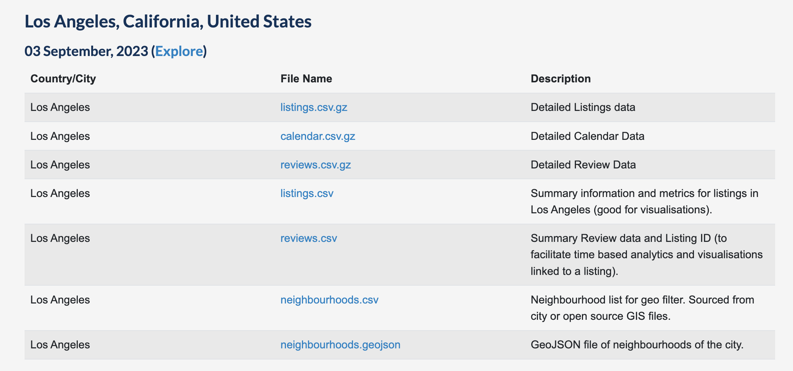
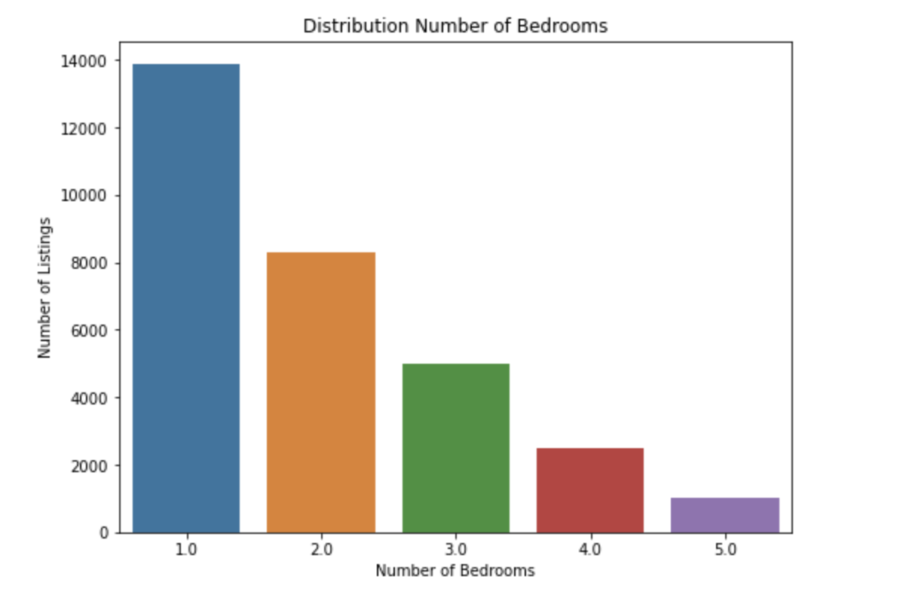
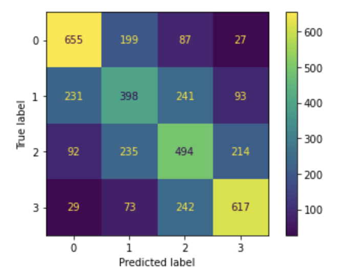
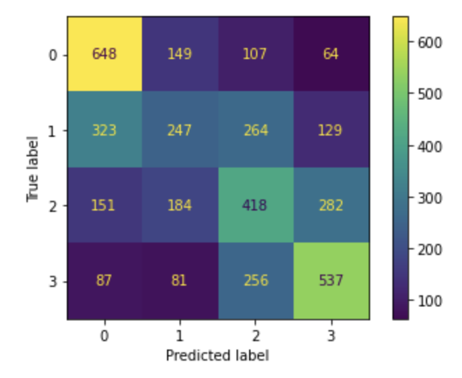
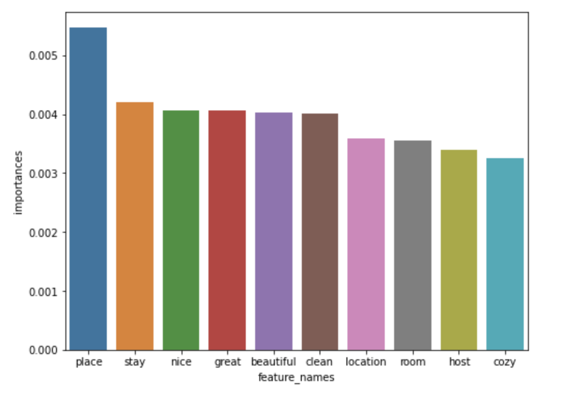

# Airbnb Price Analysis

**Analyst**: JF Roberts

<p align="center">
  
</p>

## Overview
A boutique real estate firm has contracted us out of Manhattan Beach California to help them optimize the Airbnb branch of their business. With hundreds of properties across Los Angeles, this firm wants to ensure that they are maximizing return on each of their properties by setting an optimal per-night price point. With detailed information and numerous written reviews for each of their properties, they wish to uncover whether these written reviews along with other features can be used to set optimal price points.

## Business Understanding
To perform this analysis, we created a classification model to explore whether Airbnb written reviews are reliable predictors for the ‘price per night’ of a given Airbnb listing. Specifically for one-bedroom listings, they occupy most of the Airbnb listings in greater Los Angeles. Based on the results, this analysis will clearly recommend how The Manhattan Beach Group should utilize this model to optimize its listing price-setting strategy.

## The Data
<p align="center">
  
</p>

For this price analysis, we pulled two data sets from [Inside Airbnb](http://insideairbnb.com/get-the-data/). "Inside Airbnb" is a website that sources Airbnb data quarterly for cities worldwide. It includes data on _listings_, _reviews_, _neighborhoods_ and _calendar information_. The first data set includes detailed information such as **price, number of bedrooms, neighborhoods, property type, and ratings** from over 44,000 Airbnb listings in greater Los Angeles. The second data set includes over 1.5 million **written reviews** corresponding to the listings in the first data set.  In the "Data Preparation" section below we will merge these two data sets and filter them down to the features of interest.

**How To Get The Data:** Apart from the cleaned and processed data (_processed_data.csv_), the data sets were too large to push to GitHub. Find the relevant download links below:

[Airbnb Listings & Reviews](http://insideairbnb.com/get-the-data)

<p align="left">
  
</p>

## Data Preparation

**Listings Data Set:** To make our analysis as granular as possible, we focused on listings with a specific number of bedrooms. As you can see from the graph below, 1-bedroom listings made up the majority of the data. As a result, we dropped all listings with more than 1 bedroom. To make our **target variable, price**, easier to work with we converted the price feature to a price range based on the interquartile price range in this data set. As a result, our target variable was broken down into four classes of price points.

<p align="left">
  
</p>

**Reviews Data Set:** Our first task with the written reviews was to group reviews by their respective listings reducing the data from 1.5 million reviews to 33,000. After cleaning our features of interest and [joining](https://github.com/danielburdeno/Kindle-eBook-Recommendations/blob/main/DataPrepFinal.ipynb) the data sets we pre-process our text data to prepare it for modeling.

**Text Processing:**
1. Dropping symbols, numbers and non-English characters
2. Converting all characters to lowercase
3. Tokenizing our words
4. Part of Speech Tagging (POS tagging)
5. Lemmatizing using _WordNetLemmatizer_

## Evaluation Metric
It’s often the case, in a business problem, that we focus on either minimizing false negatives or false positives. In other words, we focus on precision or recall as our evaluation metric.

In this case, there’s no distinction between the two as both a false positive and a false negative reflect an inaccurate per-night price point prediction. Because of this, we chose accuracy as our evaluation metric. Accuracy in this case is how well our model predicts the actual per-night price point range of a one bedroom listing.

## MODELING

## Modeling Overview
We used three different combinations of features for our modeling. Within each feature combination, we ran multiple types of classification models. Using GridSearchCV, we itterated over each model to get the best possible combination of hyperparameters in order to build the most accurate predictive model possible.

**1. Model Features: Reviews**

In this first group of models, the only feature used as a predictor are the tokenized written reviews for each listing.

Models Used:
- Logistic Regression (Baseline Model)
- Random Forest Classifier
- K-Nearest Neighbors
- Naive Bayes
- Simple Neural Network

**2. Model Features: Ratings, Reviews & Neighborhoods**

In this second group of models, we added in the features 'overall rating' and 'neighborhoods' to our analysis.

Models Used:

- Logistic Regression
- Random Forest Classifier

**3. Model Features: All Ratings, Reviews, Neighborhoods, Property Type & Bathrooms**

In this third and final group of models, we added in all rating features, 'property type', and number of 'bathrooms' to our analysis.

Models Used:

- Logistic Regression
- Random Forest Classifier

**FINAL MODELS:**

1. Logisitc Regression #3 - Tuned
- **Train Accuracy Score: 83%**
- **Test Accuracy Score: 55%**

<p align="left">
  
</p>

**Though our overall Accuracy score for our best model is 55%, if we look deeper, based on the above confusion matrix, our Accuracy for both the first and fourth class of price range is near 70%.**


2. Random Forest Classifier #3 - Tuned
- **Train Accuracy Score: 100%**
- **Test Accuracy Score: 53%**

<p align="left">
  
</p>

**Though our overall Accuracy score for our second best model is 53%, if we look deeper, based on the above confusion matrix, our Accuracy for both the first and fourth class of price range is also near 70%.**


## Feature Importances
Let's extract the top 10 feature importances from our best-performing Random Forest Classifier. Specifically, we are looking at the feature importance of our reviews - text data - therefore our features will be specific words. In our top 10, we find words like _nice_, _beautiful_, _great_, and _clean_ which all have positive connotations. This indicates that our model relies more heavily on these 'positive' words when making predictions about price.

<p align="left">
  
</p>

## Evaluation
- Typically, in a classification problem, a regression estimator such as Logistic Regression is less suited as it assumes a linear relationship. Its classifier counterparts such as Decision Trees and Random Forests on the other hand, are well suited for classification as they focus on feature selection - weighing important features more heavily. It is interesting then that our Logistic Regression had the highest accuracy score.
  
- That said, as we increased the number of features in our model to improve on our cross-validation test scores, our Logistic Regression training scores actually dropped from 99% down to 83% whereas our second-best model, Random Forest's, training score remained at 100%. This suggests that our Random Forest Classifier may outperform the Logistic Regression as we pull in more features and data.
  
- Our best model has a low accuracy score of 55%. This means that our model accurately predicts the actual price of a listing 55% of the time based on the chosen features. Though as mentioned in the modeling section above, when looking at specific classes (price ranges), our model predicts the first and fourth classes with 70% accuracy. In a business context, our model accurately predicts the price range for a given listing 70% of the time if that listing is predicted to be less than $109 or more than $199.
  
- Though our test scores were low, an important thing to note is that our training scores were as high as 100%. This means we could potentially get to a decent predictor by continuing to tune our model to increase our accuracy score.

## Conclusion
**Recommendations:**

**1. Unreliable Model** - At this point in time, this predictive model is not reliable enough to solve The Manhattan Beach Group's business problem of optimizing per night price point setting. Implementing a price prediction model with an accuracy score just over 50% is not a feasible business strategy.

**2. Use Model For Specific Classes** - Though our overall Accuracy score for our best model is 55%, as mentioned above, if we look deeper, our Accuracy for both the first and fourth class of price ranges is near 70%. We recommend price setting based on our models' predictions only if it predicts the first or fourth class of price ranges - and even then, take the predictions with a grain of salt as again, the model is only 70% accurate in those cases.

**Next Steps:**

**1. Potential for a good predictor** - Though our current model falls short, as noted in our evaluation, there is potential for a good model to be developed. The biggest barrier that we faced was extremely long model tuning times. Given more time we are confident we can improve our model enough to make it a good price predictor. Specifically, we believe that working with a much larger data set could help our model generalize better. This could be easily achieved as Airbnb data is widely accessible.

**2. Parallel Analysis** - Seeing that there are over 70 distinct features in Airbnb Listings data, we recommend funding a parallel analysis that focuses on these features rather than the written reviews for each listing.

**3. Advanced Data Processing** - Given more time we would implement more advanced data processing techniques. Specifically, we would utilize pre-trained text processing models such BERT, a deep learning model developed specifically for text classification.

## Repository Structure
```
├── data
├── images
├── working_notebooks
├── .gitignore
├── README.md
├── airbnb_nlp_reviews.ipynb
├── data_preparation.ipynb
└── presentation.pdf
```
### Sources:

1. [Kindle Recommendations](https://github.com/danielburdeno/Kindle-eBook-Recommendations)
2. [Airbnb & Zillow Analysis](https://github.com/Srihari231092/airbnb_zillow_analytics)
3. [A past group project: Twitter Sentiment Analysis](https://github.com/aungsias/TwitterNLP/tree/main)


